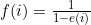

# VO₂ Multilayer Inverse Design Using Genetic Algorithm

This repository contains the code developed for a research project conducted as part of the Thematic Core – Alternative Energy Sources course in the Computer Engineering bachelor's program at Universidade Federal do Vale do São Francisco (UNIVASF).

## Motivation

VO₂ is a widely studied material for smart window applications due to its reversible `metal–insulator transition (MIT)`, which leads to infrared-blocking behavior at approximately 68 °C (154.4 °F).

## Hypothesis

Given that existing methods to reduce the critical temperature of the metal–insulator transition (MIT) are complex and not yet suitable for large-scale industrial production, this raised the following question for `Joaquim Junior Isidio De Lima`, a professor at UNIVASF:

> Is it possible to design a multilayer structure containing VO₂ that exhibits the desired behavior of VO₂ in its insulating phase at a lower temperature, for example, 26 °C (78.8 °F)?

To investigate this question, the professor began testing several structures using the `Finite Element Method (FEM)` in a professional simulation software.

However, the search space of possible multilayer configurations is extremely large, making an exhaustive search computationally infeasible. For this reason, we proposed simplifying the problem as an optimization task involving the inverse design of the structure through parameter optimization of a `Transfer Matrix Method (TMM)`.

## Methodology

The methodology adopted in this research was based on the following steps:

1. Define a target function mathematically
2. Optimize the parameters of the TMM model using a `Genetic Algorithm (GA)`
3. Select the five best-performing structures.
4. Use a paired t-test to compare the structures using `FEM` and `TMM` results

### Genetic Algorithm

The implementation of the `GA` followed the standard approach, with the necessary operators adapted to operate correctly in this context.

#### Phenotype Structure

In the context of a `GA`, a phenotype represents a solution to the problem. In this work, the phenotype is defined by the following structure:

- A gene representing the number of layers in the structure
- A chromosome representing the arrangement of the layers in the structure

Inside the chromosome, a gene pair `(r, t)` is defined, where `r` represents the refractive index of the layer material at 26 °C (78.8 °F), and `t` represents the thickness of the material. Each pair `(r, t)` therefore defines a single layer in the structure.

#### Initial Population Generation

#### Fitness

The fitness function consists of the following mathematical function:

Where `i` denotes the individual and `e(i)` is the weighted Root Mean Square Error (RMSE) between the target function and the spectrum of the current structure.

Since the light spectrum can be divided into three main ranges, weights were assigned to each range to represent their relative importance in the optimization process. The weights used were:

- 0.45 for the infrared spectrum
- 0.35 for the visible spectrum
- 0.20 for the ultraviolet spectrum

#### Parents Selection

Parent selection was performed using tournament selection, in which a subset of the population is chosen through `k` tournaments with `n` participants each. The winner of each tournament is determined based on its fitness value.

#### Crossover Operator

Due to the vector representation of the chromosome, the two-point crossover operator was applied. The same strategy was also used for the gene representing the number of layers.

Since the number of layers may differ between individuals, the crossover points were determined based on the parent with the smallest chromosome length.

#### Mutation Operator

### New Population Selection

The selection of the new population was based on the `(μ + λ) evolutionary strategy`, in which parents and offspring are ranked according to their fitness and the best individuals are selected to form the next population.

This strategy ensures that the best solutions found so far are preserved while allowing newly generated candidate solutions to compete for survival in the next generation.

### Statistical Analysis

To obtain a reasonable amount of data for the paired t-test, the layer thickness was perturbed between one percent and ten percent, in steps of zero point five percent, generating twenty-one samples for each structure.

After that, all samples were evaluated using `TMM` and `FEM`, and the paired t-test was applied.

## Results